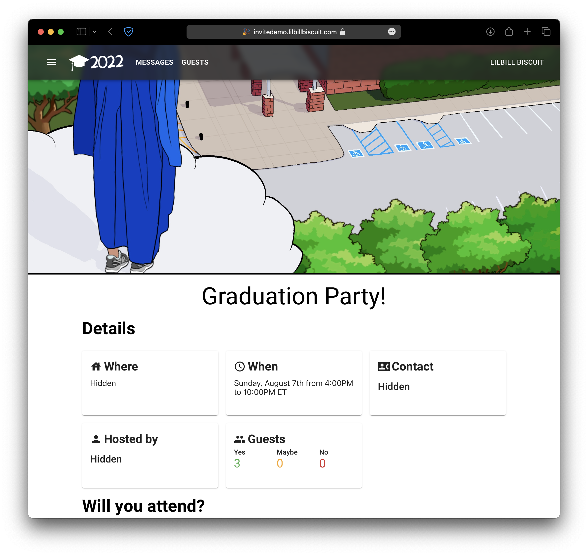
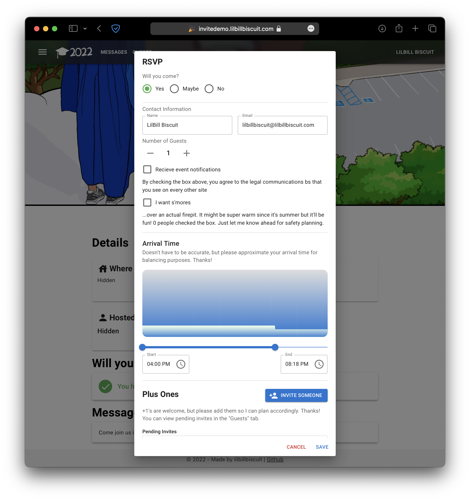

# Invite - an invitation management platform

Frontend written using **React** and **[Material UI](https://mui.com)**;
Backend written using **Express.js**, **MongoDB**, and the **AWS SDK**

Public demo here (unlimited use invitation URL): [https://invitedemo.lilbillbiscuit.com/02eb57ac29](https://invitedemo.lilbillbiscuit.com/02eb57ac29)



And the RSVP Dialog:



## Develop Locally
First, we will need to run the React website:
1. Clone the repository: ```git clone https://github.com/lilbillybiscuit/InviteWebapp.git```
2. Install required dependencies with `npm install`
3. Run `npm start`. The website should be accessible on `http://localhost:3000`

Next, we need to set up the [API Server](https://github.com/lilbillybiscuit/InviteApi):

4. Clone the repository to another location: ```git clone https://github.com/lilbillybiscuit/InviteApi.git```
5. Copy the config file with `cp config.js.copy config.js` and put in your own parameters
6. Run `node createDefaultAccount.js` to generate an administrator account. The code will output something like
```Account ID: XXXXXXXXXX, username: mainaccount```
Note the Account ID for the next step

Finally, log into the development instance:

7. Navigate to Guest on the top right, and in the dropdown click "Change Accounts"
8. In the dialog that appears, paste the Account ID that you noted earlier, and click "Change"

Now, you should have completed the setup for the development instance.
